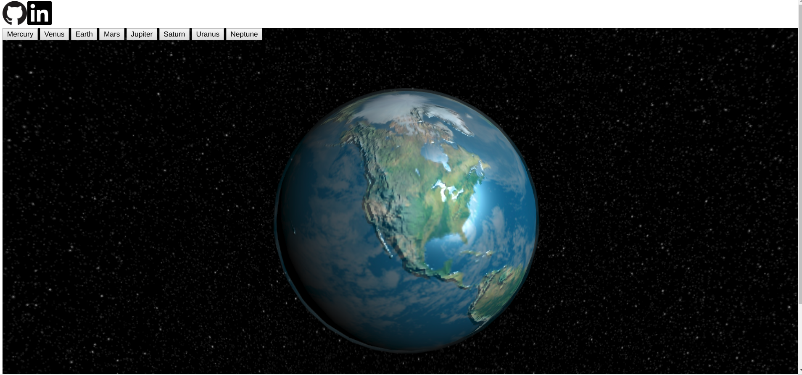

# Space.js

[Space.js](https://fwep.github.io/Space.js/) is an interactive visualizer that allows users to view photorealistic depictions of the planets. 

## Demo

## Architecture and Technologies
- Vanilla JavaScript for application logic
- HTML5's Web Audio API for sound generation, processing, and control
- Three.js for rendering of planet shapes and celestial objects
- Webpack to compile and bundle assets

## Installation
In Terminal, navigate to the root directory of the project, and run the following:

1. `npm install` (requires npm)
2. `npm run start` (has Webpack watch for any changes to the code)
4. Navigate to your browser and enter the absolute file path of the `index.html` file in the root directory in the address bar
5. Any changes made to the project will be logged by npm. To view any potential changes in your browser view, refresh the page. Alternatively, to dynamically refresh the page upon code changes, open the `index.html` file with a [live server](https://marketplace.visualstudio.com/items?itemName=ritwickdey.LiveServer).
